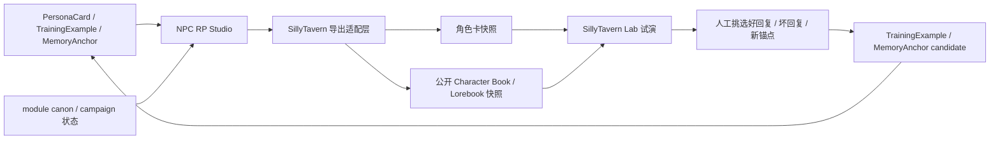

# SillyTavern 结合设计

## 目标

本项目和 SillyTavern 的关系不是“把 QQ CoC bot 改造成酒馆”，而是把两者放在各自擅长的位置：

- 本项目负责 QQ 跑团入口、CoC 规则、权限、模组 canon、campaign 状态、NPC 记忆和 keeper-only 边界。
- SillyTavern 负责角色卡调试、连续 RP 试演、swipe/regenerate/edit 工作流和沉浸式聊天手感。
- NPC RP Studio 负责在二者之间提供安全的导出、试演、反馈回流和提示词检查。

第一版优先做低风险结合：从本项目向 SillyTavern 导出可测试快照，再把满意或失败的试演结果人工回流成训练样本。不要在第一版直接同步数据库、读取酒馆聊天库或让酒馆接触本项目 `.env`、SQLite、keeper-only 模组资料。

## 总体架构

权威状态只在本项目中维护。SillyTavern 得到的是一个带来源标记的快照，用于试演和调参；快照里的新剧情不会自动写回 canon。

## 第一版结合范围

第一版包含：

- 从 `PersonaCard` 导出 SillyTavern 可导入的角色卡数据。
- 从公开且已确认的 `MemoryAnchor`、模组公开条目和 NPC 场景资料生成角色随附的 `character_book` 或独立 lorebook 快照。
- 在导出包里写入来源元数据，例如 `personaId`、导出时间、导出可见性、项目版本和源数据摘要。
- 在 NPC RP Studio 中提供导出预览，明确显示哪些字段会进入 SillyTavern。
- 允许 KP 把 SillyTavern 试演中的好回复、坏回复和可复用锚点手动保存回本项目。

第一版不包含：

- 自动读取或写入 SillyTavern 安装目录。
- 双向同步 SillyTavern 聊天数据库。
- SillyTavern 扩展开发。
- OpenAI 兼容的 SillyTavern 网关 API。
- 让 SillyTavern 直接访问本项目 `.env`、SQLite、`data/module_imports`、`logs` 或 keeper-only 文件。
- 把骰子、SAN、技能检定和角色卡数值交给 SillyTavern 或模型维护。

## 数据边界

普通导出只允许玩家可见资料：

- `PersonaCard.publicDescription`
- `speechStyle`
- `knowledgeBoundary` 中玩家可见的部分
- `exampleDialogues`
- `avoidRules`
- `patiencePolicy`
- `agencyRules`
- `abnormalInputPolicy`
- `tableBoundaryPolicy`
- `anchorStyle`
- `continuityRepairPolicy`
- `MemoryAnchor.visibility = player` 且 `status = confirmed` 的锚点
- 模组公开条目和当前场景中玩家已经接触过的事实

普通导出禁止包含：

- `privateNotes`
- keeper-only 模组真相、凶手、幕后动机、隐藏结局
- PL 未获得的线索
- 其它 PL 的私密记忆或 C2C 私聊内容
- 原始 QQ openid、绑定码、私聊投递状态、运行日志和密钥
- 模型临时补写但尚未确认的关键事实

KP-only 导出必须显式选择，文件名、角色名或导出说明中必须带有清楚标记，例如 `林医生 [KP-only]`。KP-only 导出仍然只是本地试演快照，不能作为玩家版角色卡继续分发。

## 角色卡字段映射

导出适配层应生成独立对象，不让 SillyTavern 字段名污染本项目核心数据模型。

| 本项目字段 | SillyTavern 角色卡方向 | 规则 |
| --- | --- | --- |
| `name` | `name` / `data.name` | 保持 NPC 名，不拼接群名或平台用户身份。 |
| `publicDescription` | `description` / `data.description` | 只写玩家可见外观、身份和公开背景。 |
| `speechStyle` | `personality` / `data.personality` | 写口吻、节奏、常用动作和表达习惯。 |
| `knowledgeBoundary` | `scenario` 或 `system_prompt` | 写 NPC 知道什么、不知道什么、不能透露什么。 |
| `exampleDialogues` | `mes_example` | 用于塑形，不写 keeper-only 答案。 |
| `avoidRules` | `post_history_instructions` | 写防剧透、防越权、防现代助手口吻规则。 |
| `patiencePolicy` / `agencyRules` | `system_prompt` 或 `post_history_instructions` | 写 NPC 何时拒绝、离开、降低信任或要求玩家说明来意。 |
| `MemoryAnchor` | `character_book.entries` | 只导出玩家可见且已确认的锚点，保留来源摘要。 |
| `tags` | `tags` / `data.tags` | 加上 `qq-coc-bot`、模组名、NPC 类型等标签。 |
| 项目来源元数据 | `data.extensions.qq_coc_dice_bot` | 写 `personaId`、`visibility`、`generatedAt`、`sourceVersion`。 |

如果目标版本支持 `chara_card_v2` 和 `chara_card_v3`，第一版优先生成兼容面更明确的 v2 JSON 结构；后续再补 PNG 元数据写入或 v3 专用导出。导出器必须集中封装，方便 SillyTavern 格式变动时只改适配层。

## Lorebook 快照

SillyTavern 的世界书适合提供“可被角色引用的材料”，不适合当本项目的状态账本。导出时应按快照处理：

- 每条 entry 的 `content` 写玩家可见事实或场景质感。
- `keys` 使用 NPC 名、地点、物件、组织名和常见别名。
- `comment` 写来源摘要，例如 `sourceRef`、锚点类型、事实等级和导出时间。
- `extensions.qq_coc_dice_bot` 写本项目自己的来源元数据。
- `constant` 只用于必须稳定出现的场景事实；普通线索优先用关键词触发。
- `enabled` 默认开启，但导出预览中必须允许 KP 取消某些条目。

模型临时补写的新 NPC、精确人数、地点移动或关键事实，即使来自一次很满意的 SillyTavern 试演，也只能回流为 `MemoryAnchor.status = candidate`，由 KP 确认后才进入下一次导出。

## 反馈回流

SillyTavern 试演结果回流时采用人工选择，不直接同步聊天库。

回流入口：

- 好回复：保存为 `TrainingExample.goodReply` 或追加到 `exampleDialogues`。
- 坏回复：保存为 `TrainingExample.badReply`，记录 `issueType`，例如太啰嗦、太顺从、泄露真相、不像真人、过度发明。
- 修正版回复：保存为 `TrainingExample.correction` 和 `goodReply`。
- 可复用物件、台词、关系变化：保存为 `MemoryAnchor.candidate`。
- 明确错误事实：保存为 `MemoryAnchor.rejected` 或训练样本中的反例。

NPC RP Studio 可以提供“从剪贴板导入一段试演”的轻量入口，但必须让 KP 明确勾选要回流的内容。默认不把整段酒馆聊天当作可信记忆。

## 未来网关路线

OpenAI 兼容网关可以作为第二阶段或第三阶段能力，但第一版不做。它的价值是让 SillyTavern 使用本项目后端来拼装 NPC 上下文，而不是让酒馆自己维护全部真相。

可选模式：

- 薄代理模式：SillyTavern 仍自己拼 prompt，本项目只代理模型请求、统一密钥和日志。这个模式风险低，但不会使用本项目的模组权限和剧情状态。
- 权威上下文模式：SillyTavern 只提供当前角色、玩家消息和聊天片段，本项目负责拼装 PersonaCard、MemoryAnchor、module/campaign、sceneClock、权限过滤和最终 prompt。这个模式价值最高，但通常需要酒馆扩展或严格的聊天模板配合。
- 调试模式：网关返回模型回复的同时，给 NPC RP Studio 写入 Prompt Inspector trace，便于查看本轮命中了哪些资料。

权威上下文模式必须满足：

- 本项目识别当前调用者是否为 KP/PL/OB。
- keeper-only 资料只在 KP 授权的调试或 KP-only 会话中注入。
- SillyTavern 发来的角色卡内容不能覆盖本项目的 canon 和 campaign 权威状态。
- 骰点、技能检定和 SAN 仍由本项目命令或本地规则层处理。
- 网关响应不能把 Prompt Inspector trace 直接发回玩家可见聊天。

## 安全与可观测性

每次导出应生成 manifest，记录：

- `exportId`
- `personaId`
- `npcName`
- `visibility`：`player` 或 `kp`
- `generatedAt`
- `sourceVersion`
- `sourceHash`
- `includedAnchors`
- `excludedPrivateFields`
- `targetFormat`
- `files`

导出默认写到被 `.gitignore` 排除的运行时目录，例如 `outputs/sillytavern/<exportId>/`。不要把导出包、试演聊天记录或 KP-only 快照提交到仓库。

Prompt Inspector 至少要显示：

- 本轮导出使用的人格卡字段。
- 被纳入的公开锚点和 lorebook 条目。
- 被排除的字段数量和原因。
- 是否启用了 KP-only 导出。
- 目标格式和兼容性提示。

## 验收标准

- 普通导出文件中搜索不到 `privateNotes`、keeper-only、绑定码、openid、`.env` 值和本地日志内容。
- 玩家版角色卡可在 SillyTavern Lab 中导入，并能保留 NPC 名、口吻、示例对话和基础边界规则。
- 玩家版 lorebook 只包含玩家可见且已确认的事实。
- KP-only 导出必须显式触发，并在名称或 manifest 中清楚标记。
- 从 SillyTavern 试演回流的内容默认不会进入 canon；新事实先进入候选锚点。
- NPC RP Studio 能显示导出预览和 Prompt Inspector 摘要。
- 文档或实现改动提交前，按项目规则更新 `CHANGELOG.md`；如果后续实现源码、配置或 Skill 行为，再按版本规则递增版本号。
